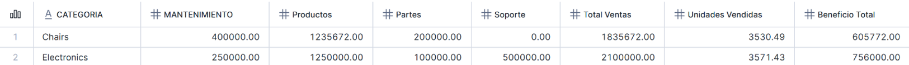
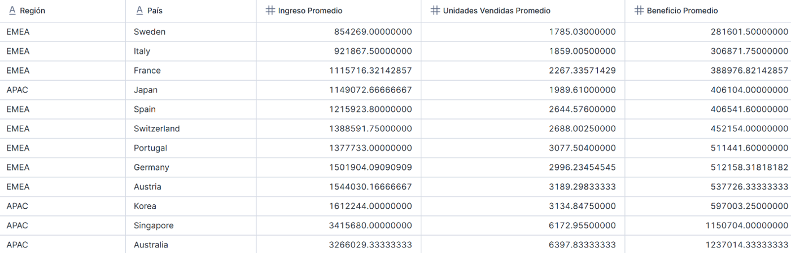
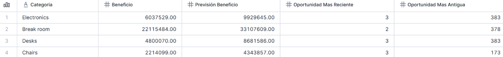
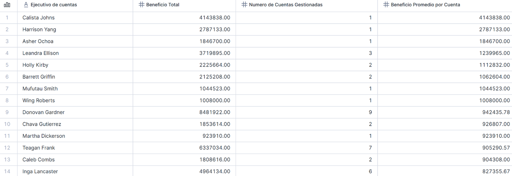
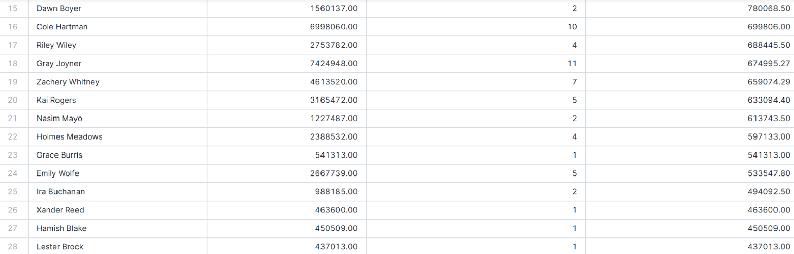
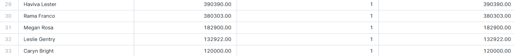

## Ejercicio de Smart Desk

## Introducción

Este documento presenta la resolución de la Tarea Final correspondiente a la asignatura de 
Base de Datos SQL, centrada en el caso de estudio de la empresa Smart Desk. 
El desafío principal de Smart Desk, derivado de su expansión internacional, es la necesidad de 
convertir sus grandes volúmenes de datos en decisiones estratégicas que impulsen las ventas y 
maximicen los beneficios. Asumiendo el rol de consultor SQL para este proyecto, el objetivo de 
este informe es analizar los conjuntos de datos de Ventas, Clientes y Pronósticos para descubrir 
patrones, evaluar la rentabilidad y proporcionar recomendaciones basadas en la evidencia. 
El presente informe se estructura en dos secciones principales, de acuerdo con los requisitos 
de la evaluación: 
**Reflexiones sobre los ejercicios guiados**: Un análisis detallado de los insights obtenidos en 
cada una de las cuatro consultas SQL solicitadas. Más allá del código, se interpreta el 
significado de los resultados y cómo estos pueden influir en la estrategia de la empresa. 
**Caso Práctico de Análisis libre**: Un análisis que parte de una pregunta de negocio específica. 
Esta sección incluye la formulación del problema, un análisis exploratorio, las consultas SQL 
utilizadas para resolverlo y la reflexión junto a las recomendaciones para Smart Desk. 

## Reflexión de Ejercicios Guiados

## Ejercicio 1: Análisis de Ventas 

**Enunciado**: La dirección comercial necesita un análisis detallado del desempeño de la cuenta 
Adabs Entertainment durante el año 2020. Se requiere un desglose completo por categoría de 
producto que incluya todas las líneas de ingreso (mantenimiento, producto, partes y soporte), 
las unidades vendidas y el beneficio generado. 
**Reflexión y Análisis de Resultado**: 

[Ver el script](./01.sql)

 El análisis de la cuenta Adabs Entertainment en 2020 revela que durante este año el gasto se 
limitó a solo dos categorías, de las cuales Electronics se posiciona como la categoría principal 
generando el mayor Beneficio Total ($756,000) y el mayor Total de Ventas ($2,100,000). A 
continuación, se va a realizar un análisis más profundo para poder ver los márgenes y revelar 
posibles oportunidades. 
**Cálculo de la Rentabilidad**: El margen de beneficio (Beneficio total/Total de ventas) es mayor el 
de Electronics (36%) que el de Chairs (33%), pero siendo las dos rentables.  Al estar entre el 
30% y 40% podemos demostrar que Adabs Entertainment es un cliente con un alto margen 
para la empresa. 
**El papel de los servicios en los ingresos**: La suma de los servicios (mantenimiento+partes+ 
soporte) en Electronic son $850,000, representando al 40% del ingreso total de la categoría. 
Mientras que en Chairs son $600,000, un 33% del ingreso. En Mantenimiento y partes ingresa más Chairs pero en Soporte su ingreso es nulo mientras que Electronics ingresa $500,000 por 
este servicio. 
**La oportunidad Oculta**: Viendo que Electronic tiene una mayor rentabilidad por sus ingresos en 
Soporte, podemos ofrecer ese servicio al cliente que se ha dejado $1.25M en sillas y paga más 
por los demás servicios que en el otro producto.

## Ejercicio 2: Comparación por País:

**Enunciado**: El departamento de expansión internacional requiere comparar el rendimiento 
promedio de ventas entre los diferentes países de las regiones APAC y EMEA. Este análisis 
permitirá identificar mercados con mayor potencial y establecer benchmarks regionales para la 
toma de decisiones estratégicas. 
**Reflexión y Análisis de Resultado**: 

[Ver el script](./02.sql)

El análisis comparativo del rendimiento promedio en las regiones APAC y EMEA proporciona 
una visión clara de la jerarquía de mercados, pudiendo identificar los mercados con mayor 
potencial y establecer benchmarks regionales. Los insights clave son: 
**El dominio claro de APC**: El potencial más alto se concentra en esta región, teniendo dos países 
que operan en un nivel de rendimiento completamente distinto. Estos países con el mayor 
beneficio promedio son Australia ($1.23M) y Singapore ($1.15M), tienen más del doble de 
beneficio promedio del país más fuerte de EMEA (Austria, con $537K). 
**Fuerte Correlación entre Volumen y Beneficio**: La tabla muestra una correlación casi exacta 
entre el Beneficio Promedio, Ingreso Promedio y Unidades Vendidas Promedio. El tamaño 
promedio en los países con mayor beneficio es drásticamente mayor, reflejando que la 
diferencia entre los países es por el promedio de las unidades vendidas. 
Segmentación de mercado con sus recomendaciones estratégica: 
**Mercados estrellas**: Australia (APAC) y Singapore (APAC). En estos mercados habría que 
maximizar el éxito y tenerlos como modelo a seguir. 
**Mercados sólidos**: Korea (APAC), Austria (EMEA), Germany (EMEA), Portugal (EMEA), 
Switzerland (EMEA) y Spain (EMEA). Son países estables que en base al rendimiento se 
puede poner como objetivo al rendimiento de Austria ( 537k de beneficio y 3,189 
unidades). 
**Mercados a revisar**: Japan (APAC), France (EMEA), Italy (EMEA) y Sweden (EMEA). 
Requieren atención por estar por debajo de los demás países e iniciar una investigación 
con el objetivo de descubrir la razón de su bajo beneficio promedio.

## Ejercicio 3: Análisis de Beneficio por Industria: 

**Enunciado**: El equipo de ventas estratégicas necesita identificar qué industrias generan mayor 
beneficio entre las cuentas que se encuentran en etapa Commit (acuerdos cercanos al cierre) y 
que tienen un pronóstico superior a $500,000. Los resultados deben clasificarse como "Alto" si 
el beneficio total de la industria supera el $1,000,000, o "Normal" en caso contrario. 
**Reflexión y Análisis de Resultado**: 

[Ver el script](./03.sql)

Las industrias de categoría ‘Alto’ son: Consulting, Retail, Technology y Healthcare. A parte de 
ser industrias con grandes oportunidades de cierre, también han conseguido demostrar que 
han podido superar el millón de dólares de beneficios.  
Las industrias de categoría ‘Normal’ son interesantes por sus grandes acuerdos, pero han 
generado un menor beneficio que las anteriores. 
Este filtro es vital para ver que industrias son las que tienen acuerdos calientes y tienen alto 
valor en la cartera, pudiendo diferenciarlas y ver que industrias dan más beneficio. Da a 
entender que el esfuerzo en ventas en estas áreas está bien dirigido. 
Las recomendaciones estratégicas en estas industrias serían: 
Priorizar al grupo ‘Alto’, asignando recursos prioritarios para asegurar el cierre debido a que 
como fracase tendría un mayor impacto negativo, dada su probada rentabilidad. 
Para el grupo ‘Normal’ se deben seguir aportando recursos para poder investigar y buscar 
oportunidades, pudiendo ganar valor en la cartera. 
En conclusión, se deben de poner recursos en las industrias que están en la tabla, pero 
ponderar su esfuerzo y enfocarlo en las industrias del grupo ‘Alto’.

## Ejercicio 4: Análisis de la Trayectoria por Categorías:

**Enunciado**: La dirección financiera requiere un análisis consolidado por categoría de producto 
que compare los beneficios reales totales obtenidos en 2021 con los pronósticos totales para 
2022. Adicionalmente, se debe identificar la antigüedad de las oportunidades de venta (más 
reciente y más antigua) dentro de cada categoría para evaluar la velocidad del ciclo de ventas. 
Calcula el beneficio de 2021 junto con el pronóstico de beneficio para el año 2022, agrupando 
los resultados por categoría de producto. Además, queremos identificar la oportunidad más 
antigua y la más reciente dentro de cada categoría. 
**Reflexión y Análisis de Resultado**: 

[Ver el script](./04.sql)

Las insights claves son: 
**Comparativa Beneficio vs. Previsión**:  
**Break room**: Con un beneficio real de 22.1M en 2021, no es una categoría en crecimiento, es la 
“vaca lechera” indiscutible de la compañía. Genera casi el triple de beneficios que las otras tres 
categorías sumadas. Su previsión de 33.1M se espera un 50% de crecimiento, siendo el mayor 
crecimiento en valor absoluto y la previsión más importante para la salud financiera de la 
empresa. 
**Chairs** (+96%) y **Desks** (+81) son los verdaderos motores de crecimiento porcentual. Parten de 
las bases más bajas ($2.2M y $4.8M) y se tienen previsto que casi dupliquen la rentabilidad.  
**Electronics**: Es la segunda más rentable ($6M) y con un crecimiento del 64%. 
Con estos datos las recomendaciones son las siguientes: 
**Asegurar la previsión de “Break room”**, protegiéndola y siendo consientes de que cualquier 
fallo en esta categoría puede tener un impacto en los resultados globales. Hay que asignar 
todos los recursos posibles para cerrar esos tratos. 
**Toma de decisión en las oportunidades más antiguas**: No es normal que en las categorías con 
mayor crecimiento (Chairs and Desks) haya oportunidades de ventas estancadas por más de un 
año (383 días). 
Al igual que hay que investigar que ha pasado en las oportunidades estancadas, hay que 
conocer y aprender de la gestión en las oportunidades de venta que han estado abiertas pocos 
días. 

## Caso Practico

### Introducción y Pregunta de Negocio

Para realizar el siguiente análisis es necesario ver los ejercicios anteriores y los temas 
analizados: categorías, regiones, industrias y pronósticos.  
Uno de los puntos que no se ha tocado aun y sería útil explorar es la **eficiencia del equipo de ventas**. Es muy interesante debido a que toca una de las columnas que no se ha tocado en los 
anteriores ejercicios y aporta valor a la empresa. 
La pregunta para resolver es:  
¿Cuáles son los ejecutivos de cuentas que gestionan las cuentas más rentables? ¿Existe una 
relación entre el número de cuentas que gestiona un ejecutivo y el beneficio total que genera? 
Con esta pregunta se puede identificar a los empleados estrellas y analizar si la estrategia de 
asignación de cuentas es la correcta.

### Analisis

Esta consulta nos ha permitido agrupar el rendimiento de ventas por cada ejecutivo sacando 
las siguientes métricas: 
**Beneficio Total**: La suma total de los beneficios generados por todas las cuentas asignadas a ese 
ejecutivo. 
**Número de Cuentas Gestionadas**: El conteo único de clientes que gestiona cada ejecutivo. 
**Beneficio Promedio por Cuentas**: La división del Beneficio Total entre el Numero de Cuentas 
Gestionadas. La tabla esta ordenada según la eficiencia de esta métrica. 

### Reflexión Final

[Ver el script](./caso_practico.sql)

El análisis de los datos muestra que no existe una relación directa entre tener más cuentas y 
generar más beneficio. Por lo tanto, el beneficio no lo determina la cantidad de clientes, sino la 
calidad de estos. Dentro del análisis se puede observar dos perfiles de ventas muy diferentes: 
Perfil Cazador: Son los que gestionan el mayor número de clientes, pero con un beneficio 
promedio por cuenta es de lo más bajos del equipo.  
Perfil Granjero: Son los que gestionan menos cuentas, pero su beneficio promedio por clientes 
es muy alto. Generan un beneficio total superior porque se especializan en maximizar el valor 
de cada relación. 
La reflexión sacada de este análisis es que para analizar la eficiencia hay que tener en cuenta 
que tipo de perfil es, ya que el rendimiento es distinto debido a que se requieren estrategias de 
gestión distintas. Los perfiles Granjero están sobrecargados y no pueden dedicar el tiempo 
necesario a cada cliente para identificar oportunidades, como la venta de servicios de 
“Soporte”. 
En el otro lado de la moneda está los perfiles Cazador que demuestran una habilidad 
excepcional para desarrollar sus cuentas, siendo mucho más rentables a la empresa, pero 
tampoco puede venir gran parte del beneficio de unos pocos clientes.  

## Conclusión General

Este proyecto de análisis ha logrado el objetivo principal de la tarea: **convertir los datos** de 
Smart Desk en **decisiones estratégicas accionables**. El análisis de las tablas ha relevado un 
panorama claro de las fortalezas de la compañía, así como de sus ineficiencias operativas 
críticas. 
Todos los ejercicios han demostrado que la rentabilidad de Smart Desk no está impulsada por 
el volumen, sino por la calidad de la venta y la eficiencia del margen. 
La **calidad de la Venta** se refleja en el beneficio, siendo más importante la calidad que la 
cantidad. En el primer ejercicio se puede ver que los servicios tienen un alto valor, como los de 
Soporte y Mantenimiento. En el ejercicio 2 y 3 también se refleja en la región APAC y las 
industrias Consulting y Retail son los ecosistemas donde la empresa es más eficiente 
generando beneficios. Y el último caso refleja el alto valor de los clientes gestionados por los 
perfiles Granjero. 
Un problema de la empresa es la ineficiencia, se puede dividir en tres partes: 
**Ineficiencia de Producto**: Las oportunidades perdidas de venta cruzada de servicios de alto 
margen. En el ejercicio 1 se ignora la venta de Soporte en las sillas cuando en el otro producto 
era una buena fuente de ingreso. 
**Ineficiencia de Procesos**: El ciclo de ventas está atascado, siendo reflejado en el ejercicio 4 que existen oportunidades en categorías clave que llevan abiertas más de un año, consumiendo 
recursos y distorsiona el pronóstico. 
**Ineficiencia de Gestión**: En el último caso se demuestra que el beneficio no proviene de 
gestionar más cuentas, sino de gestionar mejor unas pocas claves. 

Con estas ineficiencias una recomendación estratégica principal es un cambio de mentalidad: 
pasar de un modelo de “volumen” a un modelo de “eficiencia”. Esto implica reestructurar la 
fuerza de ventas para especializar a los ejecutivos en maximizar cuentas, implementar un 
proceso riguroso para las ventas estancadas y establecer como política de venta cruzada de 
servicios en todas las categorías de productos.